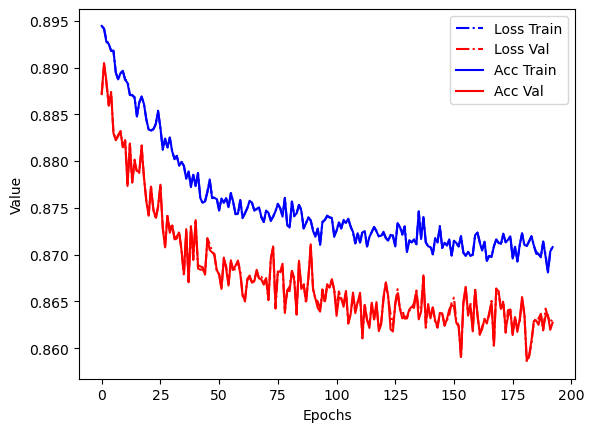
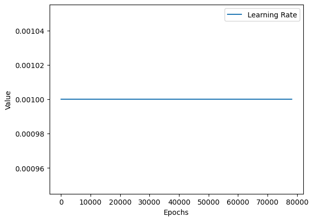
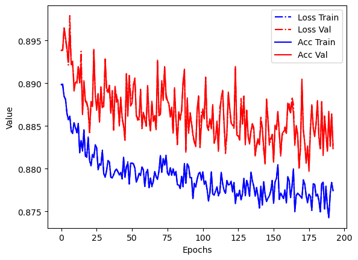
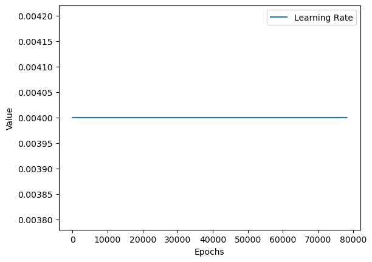
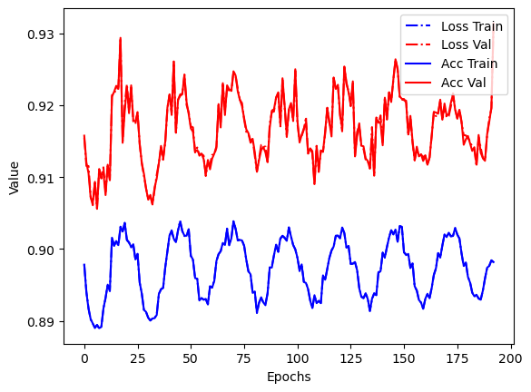
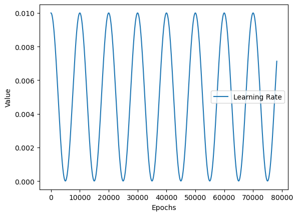
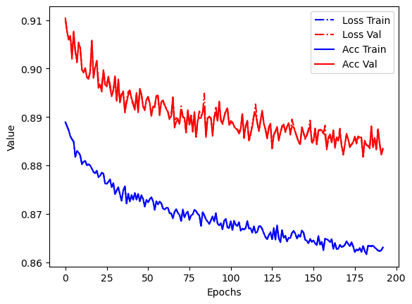
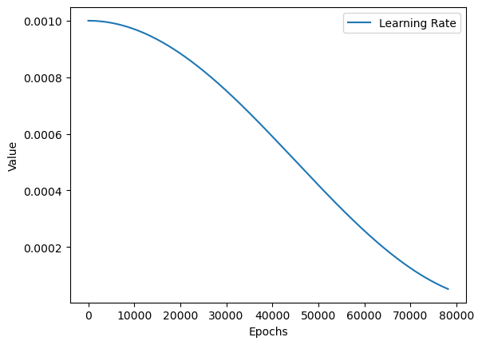

## Test 1
kFolds = 5
numEpochs = 200
batchSize = 128
learningRate = 1e-3
weightDecay = 1e-4
lossFunction = nn.MSELoss()

network = Net2(catDims=[], cntNum=len(col)-1, out_sz=1, layers=[32, 16, 8],
        dropPcts=[0.025, 0.05, 0.1], y_range=[0.0, 1.0]).to(device)
lr_cosine = ExponentialLR(optimizer, gamma=0.1)
  
  
## Test 2: Larger Learning rate

kFolds = 5
numEpochs = 200
batchSize = 128
learningRate = 4e-3
weightDecay = 1e-4
lossFunction = nn.MSELoss()

 network = Net2(catDims=[], cntNum=len(col)-1, out_sz=1, layers=[32, 16, 8],
                dropPcts=[0.025, 0.05, 0.1], y_range=[0.0, 1.0]).to(device)
lr_cosine = ExponentialLR(optimizer, gamma=0.5)
  
  

## Test 3: consine annealing: Not fitting for simple network
kFolds = 5
numEpochs = 200
batchSize = 128
learningRate = 1e-2
weightDecay = 1e-3
lossFunction = nn.MSELoss()

network = Net2(catDims=[], cntNum=len(col)-1, out_sz=1, layers=[32, 16, 8],
            dropPcts=[0.025, 0.05, 0.1], y_range=[0.0, 1.0]).to(device)

lr_cosine = CosineAnnealingLR(optimizer, T_max=5000, eta_min=1e-5)  # T_max: width of cosine/

-   
-  

## Test 4:

## Test 5: cosine annealing with only 1 curve
kFolds = 5
numEpochs = 200
batchSize = 128
learningRate = 1e-3
momentum = 0.9
weightDecay = 1e-3
lossFunction = nn.MSELoss()

network = Net2(catDims=[], cntNum=len(col)-1, out_sz=1, layers=[32, 16, 8],
            dropPcts=[0.025, 0.05, 0.1], y_range=[0.0, 1.0]).to(device)
scheduler = CosineAnnealingLR(optimizer, T_max=90000, eta_min=1e-5)
  
  
## Test 6: step lr
scheduler = StepLR(optimizer, step_size=1, gamma=0.1)

## Test 7: 
